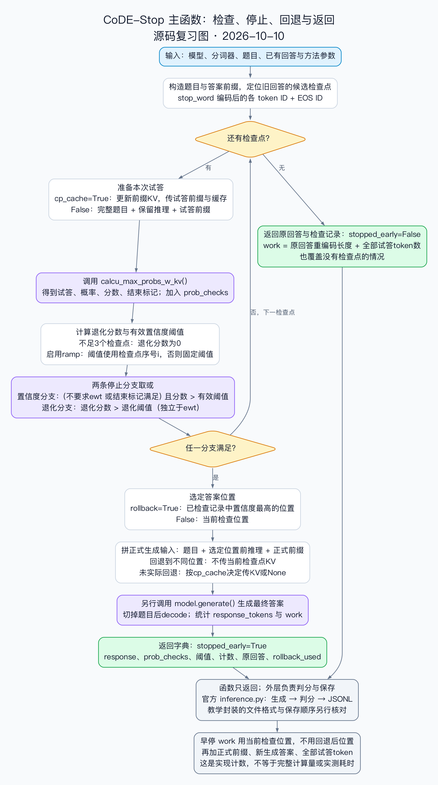

# CoDE-Stop 主函数复习图

用户于 2026-10-10 确认在 2026-10-09 完成 `method_codestop()` 阅读。本图对应[10/9 学习记录](https://app.notion.com/p/3f5cbe2923d681cfa3c4e92c4417ed70)，供[10/10 复习与轨迹解释](https://app.notion.com/p/3f5cbe2923d6810c8c3dd84ae5ef9f48)引用。

- 可编辑源：`render.py`、`overview.dot`；输出：`overview.svg`、`overview.png`。
- 沿用 `../code-reading/render.py` 的排版。项目根目录运行 `python3 docs/diagrams/method-codestop/render.py` 可重绘，不加载模型。
- 核对源码：`upstream/CoDE-Stop/method_codestop.py`，2026-10-10 本地带注释工作树；SHA-256：`bc90c56f32c30c753da624a78205c8b282128fc9ebda9307ba5c636d51ec6d7d`。
- 图覆盖正常控制流：输入、候选检查点、缓存/试答、两个分数与停止分支、rollback、最终生成、未早停返回，以及外层判分/保存边界。省略初始化兼容细节和异常路径。
- `ewt` 不约束独立退化分支；ramp 使用检查点序号；实际回退到不同位置时不传当前缓存；早停 `work` 使用检查到的位置，而非回退后的回答位置。
- 已渲染检查中文、分支和箭头。图是源码说明，不是实验轨迹，不代表读者通过独立作答或阶段实验验收。

