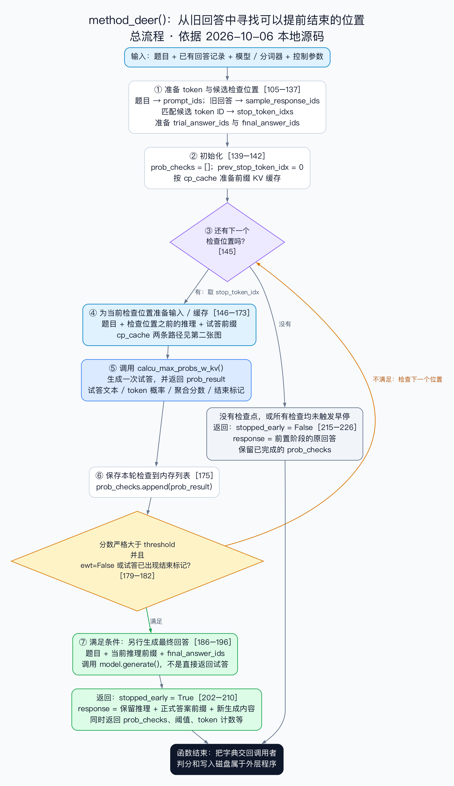
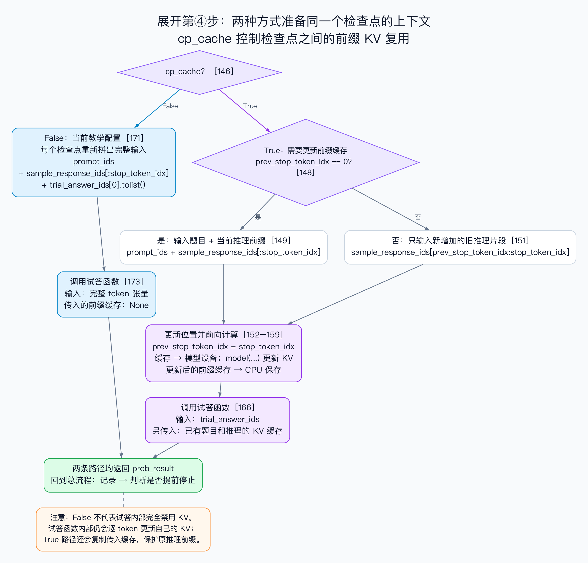

# method_deer() 阅读流程图

核对日期：2026-10-06。依据当前本地带注释的 `upstream/CoDE-Stop/method_deer.py`，固定上游提交为 `b5081e7c2abe23bb1d19649421cc13522fee7c50`。行号对应此次本地版本，后续注释可能改变位置；阅读时优先按函数名和语句定位。

本图是源码阅读材料，不是 GPU 实验结果，也不代表 D4 已验收。

## 先看总流程



输入的是已经保存的旧回答。函数在旧回答中寻找候选位置，截取该位置之前的推理，试答并计算置信度。满足条件则另行生成最终回答；检查点耗尽（也包括没有检查点）则返回旧回答。

## 再看缓存分支



当前教学配置 `configs/single_question.json` 为 `cp_cache=false`、`ewt=true`、`deer_threshold=0.95`；函数参数默认值与调用时显式传值需要区分。

## 对照源码时注意

1. `stop_token_idxs` 存的是位置下标；当前代码按 `tok in stop_tokens` 匹配 token ID，并不是通用的完整词串匹配。遇到候选 token 只开始检查，不会直接停止。
2. `sample_response_ids[:stop_token_idx]` 不包含当前下标处的 token，也不包含其后的旧推理。
3. 两种前缀都属于模型输入。`trial_answer_ids` 引导试答；`final_answer_ids` 用于决定停止后的正式生成，包含思考结束标记。试答结果不会直接替代最终生成。
4. 停止条件严格按代码为：`(not ewt or prob_result['ended_with_think']) and prob_result['total_prob_max'] > threshold`。当前配置 `ewt=true`，因此结束标记条件和严格超过阈值必须同时满足。分数不等于答案正确率。
5. 早停返回时只切掉 `prompt_ids` 对应的题目部分；`response` 仍包含保留的推理、正式答案前缀和新生成内容。`response_tokens` 也不只是最后一次新增答案的长度。源码附近的部分学习注释尚不准确，本图按可执行语句解释，未改动注释。
6. `work` 按返回回答 token 数与试答 token 数求和；不能直接当作实测耗时或总硬件计算量。
7. 函数返回字典，外层程序才负责保存和判分。没有检查点时会返回 `stopped_early=false`，但不能因此声称试答分支已经验证。
8. 缓存详图保留实际分支 `prev_stop_token_idx == 0`，它并不在所有边界情况下都等价于“第一次循环”。当前教学入口要求 `cp_cache=false`；有缓存图用于理解代码，不代表缓存路径已经实测。

## 文件与重绘

- `overview.dot`、`cache.dot`：可编辑的 Graphviz 源文件。
- `overview.svg`、`cache.svg`：可放大的矢量图。
- `overview.png`、`cache.png`：用于 Notion 和日常阅读。

在本目录运行以下命令可重新生成图像（需要 Graphviz，不需要 GPU）：

```sh
dot -Tsvg overview.dot -o overview.svg
dot -Tpng -Gdpi=150 overview.dot -o overview.png
dot -Tsvg cache.dot -o cache.svg
dot -Tpng -Gdpi=150 cache.dot -o cache.png
```

Notion 位置：[D4｜理解并运行DEER](https://app.notion.com/p/3e2cbe2923d68173800cfb6e41362822)。
